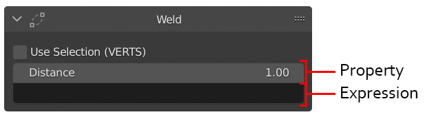
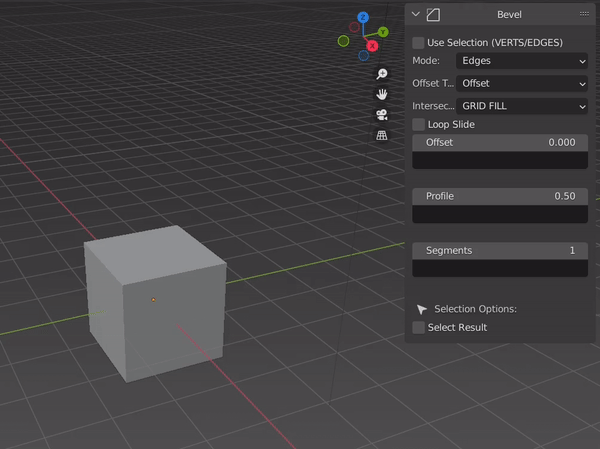
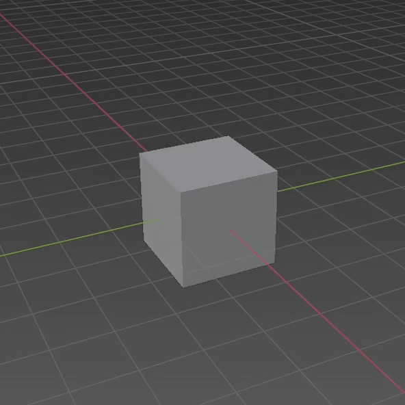
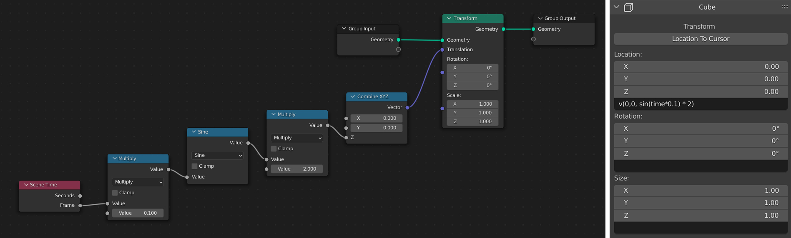
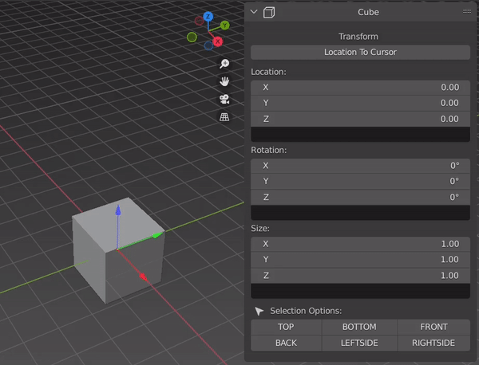
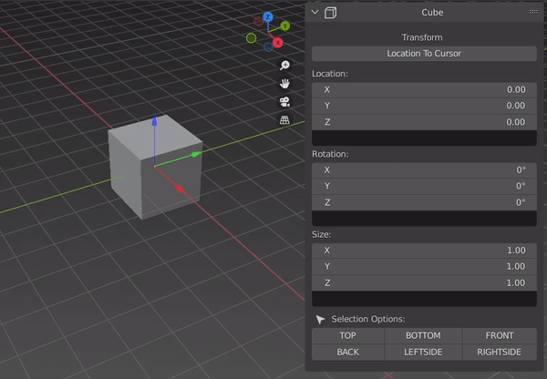
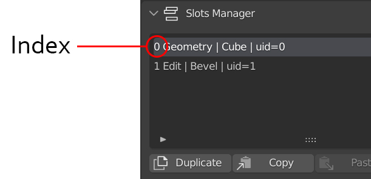
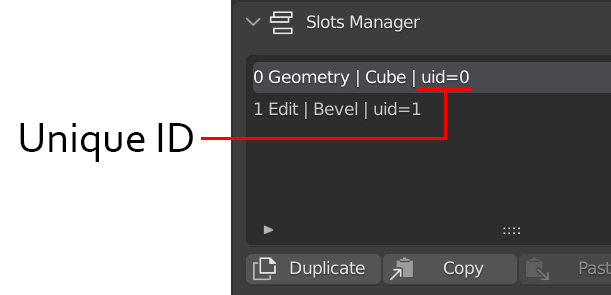
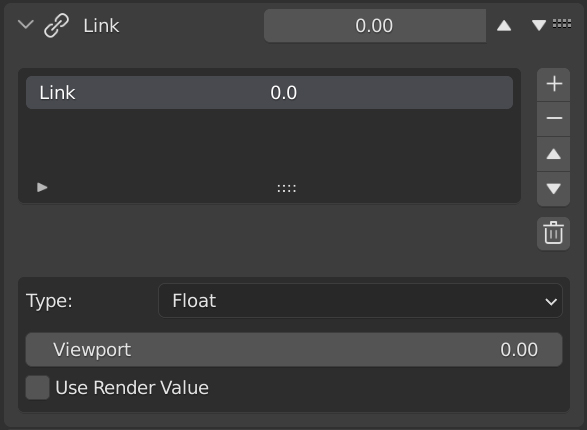

Expressions
=====

Basics
------------

.. _Geostack: https://geostack-docs.readthedocs.io/en/latest/index.html

| Expressions are text/strings that you can use with `Geostack`_ to take control of a property.
| They are located under any property that supported it.

  
  A property and an expression field.

To write an expression click with the mouse on the field and start to type.

  In this example we simply write a single value to the expression field

* Expressions support:
  
  * :ref:`values`
  * :ref:`operators`
  * :ref:`maths`
  * :ref:`links`
  * :ref:`lists`
  * :ref:`builtin`
  
| You can concatenate all of this until you get the desired value.
| It is similar when you link inputs and outputs in a node editor but, instead of using nodes, you use text.
| Let's make an example:

  A cube that float up and down.

  On the left the Geometry Nodes version of the movement on the right the Geostack one.

.. _values:

Values
------------

.. _float:

------------
Float
------------

Floating point real values: 0.5, 1.0, 2.1 etc...

.. _int:

------------
Int
------------

Signed Integer: 1, 2, 3, 4 etc..

.. _bool:

------------
Bool
------------

| Booleans represent one of two values: True or False.
| Usefull in :ref:`ternary`.

.. _vector:

------------
Vector
------------

| 3D vector with floating-point values.
| You can use them in expressions as v(x,y,z) or x,y,z if you only need one single value.

  
  Example of a new vector.
  
| Vectors support almost all operations and also support all functions of the `Python Blender API`_
| For more information about it go `here <https://docs.blender.org/api/current/mathutils.html#mathutils.Vector>`_.

.. _Python Blender API: https://docs.blender.org/api/current/index.html

.. _euler:

------------
Euler
------------

Representation of 3D vectors and points as x,y,z.

.. _object:

------------
Object
------------

| A Blender Object reference. Supports almost all blender properties.
| You can use it with links like this:
| *image here*
| For more information about it go `here <https://docs.blender.org/api/current/bpy.types.Object.html#bpy.types.Object>`_.

.. _transform:

------------
Transform
------------

| Transform is a property that contain:
|   Location :ref:`vector`
|   Rotation :ref:`euler`
|   Size :ref:`vector`

| You can use it with links like this:
| *image here*

.. _builtin:

Built-In Functions and Constants
------------

| Meow Meow Meow Meow Meow Meow Meow Meow Meow Meow Meow Meow
| Meow Meow Meow Meow Meow Meow Meow Meow Meow Meow Meow Meow
| Meow Meow Meow Meow Meow Meow Meow Meow Meow Meow Meow Meow

.. _constants:

------------
Constants
------------

| Constants are read-only properties that you can use whatever you want.

  An example of constants.

This is the list of all constants (more elements in the next updates)

.. py:data:: v_zero 

    A Zero :ref:`vector` = v(0,0,0)

.. py:data:: v_one 

    A One :ref:`vector` = v(1,1,1)

.. py:data:: v_half 

    An half :ref:`vector` = v(0.5,0.5,0.5)

.. py:data:: v_up 

    Directional up :ref:`vector` = v(0,0,1)

.. py:data:: v_down 

    Directional down :ref:`vector` = v(0,0,-1)

.. py:data:: v_right 

    Directional right :ref:`vector` = v(1,0,0)

.. py:data:: v_left 

    Directional left :ref:`vector` = v(-1,0,0)

.. py:data:: v_for 

    Directional forward :ref:`vector` = v(0,1,0)

.. py:data:: v_back 

    Directional backward :ref:`vector` = v(0,-1,0)

.. py:data:: v_yz 

    0XY :ref:`vector` = v(0,1,1)

.. py:data:: v_xz 

    X0Z :ref:`vector` = v(1,0,1)

.. py:data:: v_xy 

    XY0 :ref:`vector` = v(1,1,0)

.. py:data:: e_zero 

    A Zero :ref:`euler` = e(0,0,0)

.. py:data:: e_x45

    A X 45° :ref:`euler` = e(45,0,0)

.. py:data:: e_x90

    A X 90° :ref:`euler` = e(90,0,0)

.. py:data:: e_x180

    A X 180° :ref:`euler` = e(180,0,0)

.. py:data:: e_y45

    A Y 45° :ref:`euler` = e(0,45,0)

.. py:data:: e_y90

    A Y 90° :ref:`euler` = e(0,90,0)

.. py:data:: e_y180

    A Y 180° :ref:`euler` = e(0,180,0)

.. py:data:: e_z45

    A Z 45° :ref:`euler` = e(0,0,45)

.. py:data:: e_z90

    A Z 90° :ref:`euler` = e(0,0,90)

.. py:data:: e_z180

    A Z 180° :ref:`euler` = e(0,0,180)

.. py:data:: epsilon

    Epsilon number :ref:`float` = 0.00001

.. _slot_get:

------------
Slot Get
------------

To get a property of another slot, the method that you can use in a `Geostack`_ expression is:

.. py:function:: s( index : int, property_name : string )

| You can find the index in the slot panel and is the first number in the menu slot selector.

  
  The Slot Index.

| Slot Get is a polymorphic function that is, it supports various combinations for various needs.
| For example, if at some point, you decide to move a slot in the stack, the index you are aiming for, inevitably changes and consequently you will lose the previous reference.
| To overcome this, the solution is:

.. py:function:: s( uid : string, property_name : string )

| Where "uid" simply stands for "Unique ID". It is created and assigned every time a slot is added to the stack, it is permanent and therefore guarantees a stable reference, even when the order of the stack changes.

  The Unique Index.

| There are cases where simply referring to an index is not enough, for example, when you want to have the property of a slot that supports a sub-list like "Multi Boolean" or "Set Vertex Group", not only do you need to refer to the slot, but also to refer to its children.
| To do this you can use:

.. py:function:: s( index : int, sub_index : int, property_name : string )

.. py:function:: s( uid : string, sub_index : int, property_name : string )

| You can add another level of index for slots that support groups like "Knife" and "Lines":

.. py:function:: s( index : int, group_index : int, point_index : int, property_name : string )

.. py:function:: s( uid : string, group_index : int, point_index : int, property_name : string )

.. _maths:

------------
Maths
------------

These are compact version functions of `python maths module <https://docs.python.org/3/library/math.html>`_. 
If you need a function that is not present in this list you can try to write *"math."* before the function name  (**example**: math.sin(1)), but be aware that doing this, cannot be stable and can give you errors.

.. py:function:: sin(x)

    Return the sine of x radians.

.. py:function:: cos(x)

    Return the cosine of x radians.

.. py:function:: floor(x)

.. py:function:: fmod(x)

.. py:function:: acos(x)

.. py:function:: ceil(x)

.. py:function:: pow(x)

.. py:function:: sqrt(x)

    Return the square root of x.

.. py:function:: atan(x)

    Return the arc tangent of x, in radians. The result is between -pi/2 and pi/2.

.. py:function:: tan(x)

    Return the tangent of x radians.

.. py:function:: atan2(y, x)

    Return atan(y / x), in radians. The result is between -pi and pi. 
    The vector in the plane from the origin to point (x, y) makes this angle with the positive X axis. 
    The point of atan2() is that the signs of both inputs are known to it, so it can compute the correct quadrant for the angle. 
    For example, atan(1) and atan2(1, 1) are both pi/4, but atan2(-1, -1) is -3*pi/4.

.. py:function:: radians(x)

    Convert angle x from degrees to radians.

.. py:function:: degrees(x)

    Convert angle x from radians to degrees.

.. py:function:: factorial(x)

.. py:function:: fmod(x)

.. py:function:: frexp(x)

.. py:function:: log(x)

    With one argument, return the natural logarithm of x (to base e).
    With two arguments, return the logarithm of x to the given base, calculated as log(x)/log(base).

.. py:function:: log10(x)

    Return the base-10 logarithm of x. This is usually more accurate than log(x, 10).

.. py:function:: log2(x)

    Return the base-2 logarithm of x. This is usually more accurate than log(x, 2).

.. py:function:: log1p(x)

    Return the natural logarithm of 1+x (base e). 
    The result is calculated in a way which is accurate for x near zero.

.. py:function:: exp(x)

.. py:function:: expm1(x)

.. _operators:

------------
Operators
------------

Meow Meow Meow Meow Meow Meow Meow Meow Meow Meow Meow Meow

.. _ternary:

------------
Ternary
------------

Meow Meow Meow Meow Meow Meow Meow Meow Meow Meow Meow Meow

.. _links:

Links
------------

.. _links_basics:

------------
Basics
------------

| Links are custom global properties that you can use whatever you want in expressions.
| They can be managed easily in the links panel.

| Links have a naming convention and have two rules:
| 1 - Every links name must be a Title Case (so no lower case for the first character). 
| 2 - The only special character allowed is the Underscore, so no points, signs, or parenthesis.

* Links types are:
  
  * :ref:`float`
  * :ref:`int`
  * :ref:`bool`
  * :ref:`vector`
  * :ref:`euler`
  * :ref:`transform`
  * :ref:`links_expressions`
  * :ref:`object`
  * :ref:`lists`

.. _lists:

------------
Lists
------------

Meow Meow Meow Meow Meow Meow Meow Meow Meow Meow Meow Meow

.. _links_expressions:

------------
Link Expression
------------

Meow Meow Meow Meow Meow Meow Meow Meow Meow Meow Meow Meow

.. 
    To retrieve a list of random ingredients,
    you can use the ``lumache.get_random_ingredients()`` function:

    .. autofunction:: lumache.get_random_ingredients

    The ``kind`` parameter should be either ``"meat"``, ``"fish"``,
    or ``"veggies"``. Otherwise, :py:func:`lumache.get_random_ingredients`
    will raise an exception.

    .. autoexception:: lumache.InvalidKindError

    For example:

    >>> import lumache
    >>> lumache.get_random_ingredients()
    ['shells', 'gorgonzola', 'parsley']
    .. py:data:: Int
    .. Expressions are basicaly the text way to do spaghetti nodes.

    "v_zero = x:0 y:0 z:0
    "v_one = x:1 y:1 z:1
    "v_half = x:0.5 y:0.5 z:0.5
    "v_half_up = x:0.5 y:0.5 z:1
    "v_xy = x:1 y:1 z:0
    "v_yz = x:0 y:1 z:1
    "v_xz = x:1 y:0 z:1 \n",
    "v_up = x:0 y:0 z:1 \n",
    "v_down = x:0 y:0 z:-1 \n",
    "v_right = x:1 y:0 z:0 \n",
    "v_left = x:-1 y:0 z:0 \n",
    "v_for = x:0 y:1 z:0 \n",
    "v_back = x:0 y:-1 z:0 \n",
    "e_zero = x:0 y:0 z:0 \n",
    "epsilon = 0.00001 \n",

    This is for the basics math
    | One of the pillars of `Geostack`_ expressions are the compactness. You can only write you
