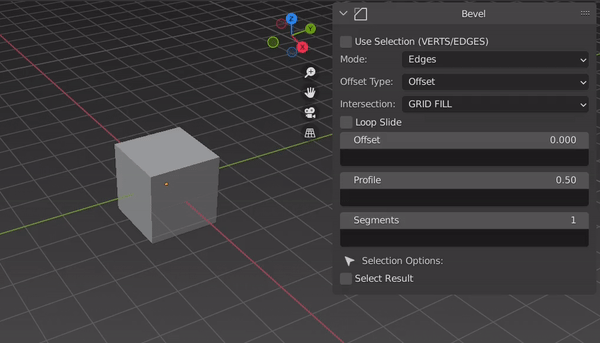

Expressions
=====

Basics
------------

| Expressions are text/strings that you can use with Geostack for take control of a property.  
| They are located under any property that supported it.

.. figure:: images/expression_field_2.jpg
  :width: 400
  :alt: Expression Field
  
  A property and an expression field.

To write an expression click with the mouse on the field and type something.

  In this example we simply write a value
  
Use Vectors
----------------

Get A Slot
----------------

Meow Meow Meow Meow Meow Meow Meow Meow Meow Meow Meow Meow

Constants
----------------

Constants are Built-In fixed variables that you can use whatever you want.

.. figure:: videos/constants_1.gif
  :width: 400
  :alt: Constants

  An example of constants

Links
=====

Basics
------------

To retrieve a list of random ingredients,
you can use the ``lumache.get_random_ingredients()`` function:

.. autofunction:: lumache.get_random_ingredients

The ``kind`` parameter should be either ``"meat"``, ``"fish"``,
or ``"veggies"``. Otherwise, :py:func:`lumache.get_random_ingredients`
will raise an exception.

.. autoexception:: lumache.InvalidKindError

For example:

>>> import lumache
>>> lumache.get_random_ingredients()
['shells', 'gorgonzola', 'parsley']
